# Networks I: serial modem client for the Ithaki virtual lab

Results and observations from two sessions with the lab server, on 20 and 22 May 2020. The task is in [brief.md](brief.md). The program is in [`../src`](../src), the recorded data in [`../results`](../results).

## What the program does

`userApplication` talks to the lab server through the course's virtual modem. In one run it:

1. requests a camera image without errors and one with transmission errors, at 80 kbps;
2. requests a GPS trace, picks every tenth sentence of it and uses their coordinates to request a map image;
3. at 1000 bps, requests packets for five minutes with the ARQ mechanism (ACK and NACK codes), measuring each packet's response time;
4. at 1000 bps, requests echo packets for five minutes, measuring each packet's response time.

The measurements of steps 3 and 4 are exported to Excel files. [`results`](../results) holds them as CSV files, one pair per session, with the columns `message`, `response_time_ms`, `ber` and `nack`.

## Images

Each session produced three pictures: E1, a camera frame without transmission errors; E2, a camera frame requested with the error code, whose errors fall in the lower half of the picture; and M1, a map image that the server builds from the positions of nine GPS sentences, which the program picked from a GPS trace (the orange dots). The lab prints the request code of the session in every picture. Here a black bar, labelled "code hidden", covers it. The map is satellite imagery from Google Maps, returned by the lab server, with its credits in the picture.

| | E1: no errors | E2: with errors | M1: GPS map |
|---|---|---|---|
| Session 1 | 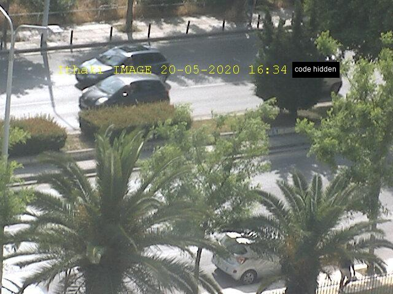 | 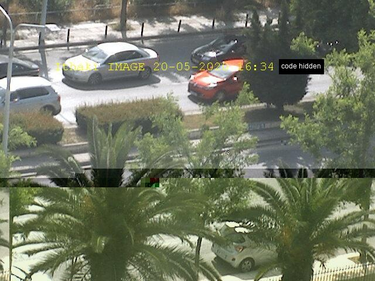 | 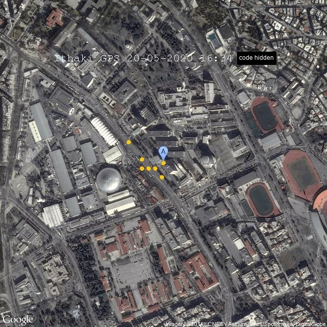 |
| Session 2 | 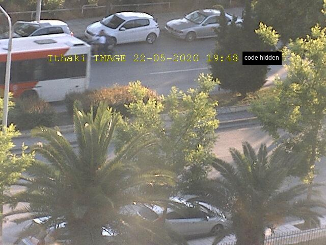 | 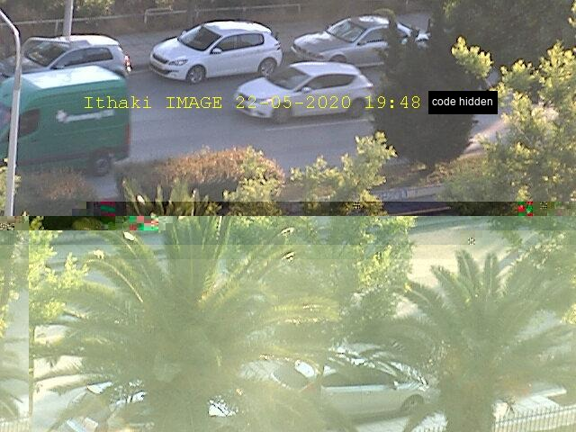 | 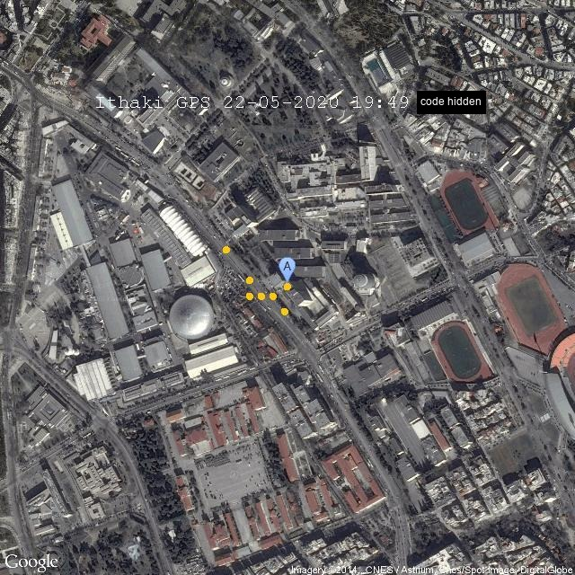 |

## Echo packets

The program requested echo packets for five minutes at 1000 bps.

| | Session 1 (20 May 2020) | Session 2 (22 May 2020) |
|---|---|---|
| Packets received | 772 | 714 |
| First packet | `PSTART 20-05-2020 16:40:01 83 PSTOP` | `PSTART 22-05-2020 19:54:23 77 PSTOP` |
| Last packet | `PSTART 20-05-2020 16:45:01 54 PSTOP` | `PSTART 22-05-2020 19:59:23 90 PSTOP` |
| Mean response time | 388.75 ms | 420.40 ms |
| Maximum | 1071 ms | 6044 ms |
| Minimum | 307 ms | 312 ms |

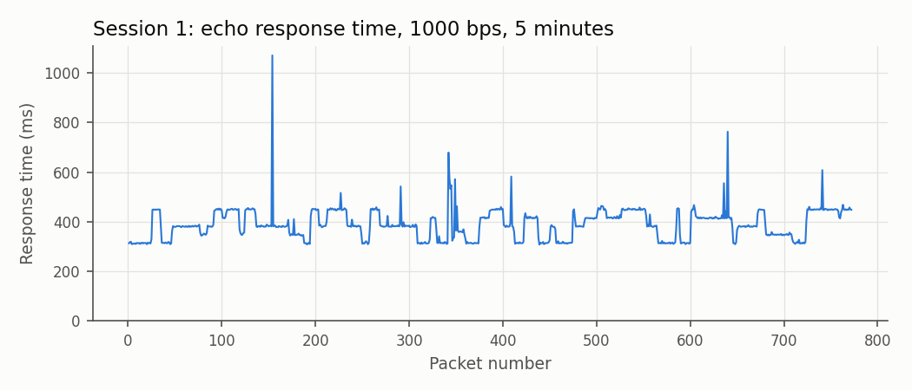

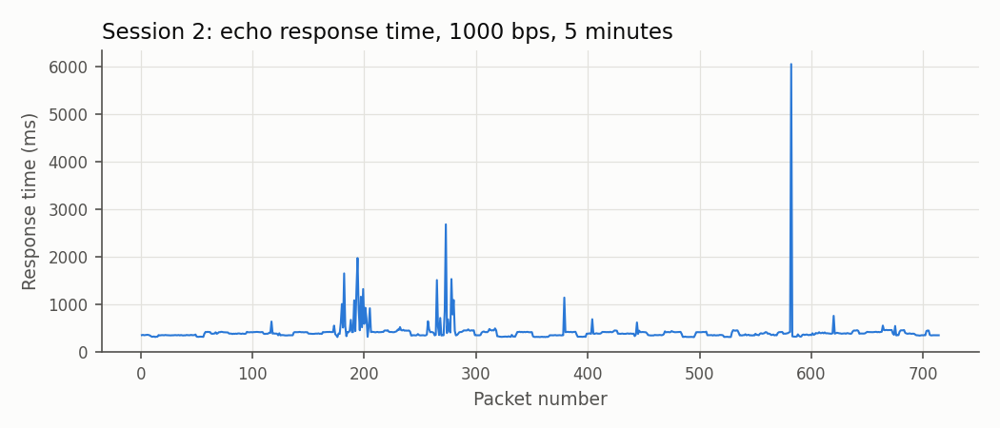

## ARQ packets

The packets requested with the ARQ codes were also received for five minutes at 1000 bps. The response times include the time the program needs to check each packet.

| | Session 1 | Session 2 |
|---|---|---|
| Packets received | 414 | 376 |
| First packet | `PSTART 20-05-2020 18:03:25 01 <QLSPrdfNMRUiYKwH> 046 PSTOP` | `PSTART 22-05-2020 19:49:24 01 <ClosQnaNcjnXICcF> 051 PSTOP` |
| Last packet | `PSTART 20-05-2020 18:08:24 14 <ngjoIuXAJdGFHNIv> 063 PSTOP` | `PSTART 22-05-2020 19:54:22 76 <mRcDJhAqBLGSBvHI> 037 PSTOP` |
| Mean response time | 725.04 ms | 798.84 ms |
| Minimum | 484 ms | 494 ms |
| Maximum | 2792 ms | 4450 ms |

Retransmissions needed per packet:

| Retransmissions | 0 | 1 | 2 | 3 | 4 | 5 | 6 |
|---|---|---|---|---|---|---|---|
| Session 1 | 337 | 61 | 12 | 2 | 2 | 0 | 0 |
| Session 2 | 290 | 62 | 13 | 7 | 2 | 1 | 1 |

In session 1, 337 of the 414 packets (81.4 %) arrived without error and were not retransmitted; 61 needed one retransmission, 12 needed two and four needed more than two. In session 2, 77 % of the packets (290 of 376) were received correctly; of the remaining 23 %, 62 packets needed one retransmission, 13 needed two and 11 needed more than two, with a maximum of six.

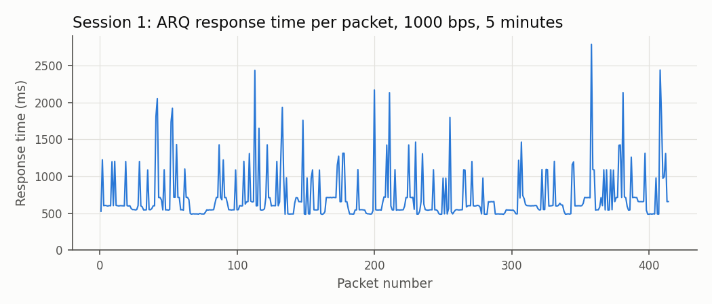

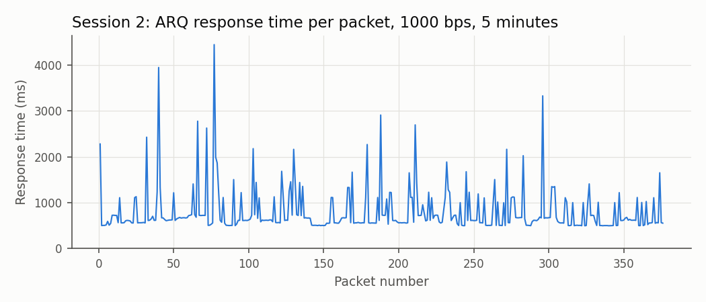

The graphs below show the number of retransmissions of a packet on the horizontal axis and the number of packets on the vertical axis. On this basis the number of retransmissions is estimated to follow a geometric distribution.

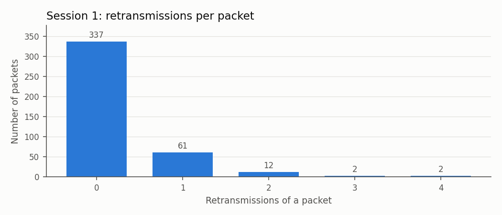

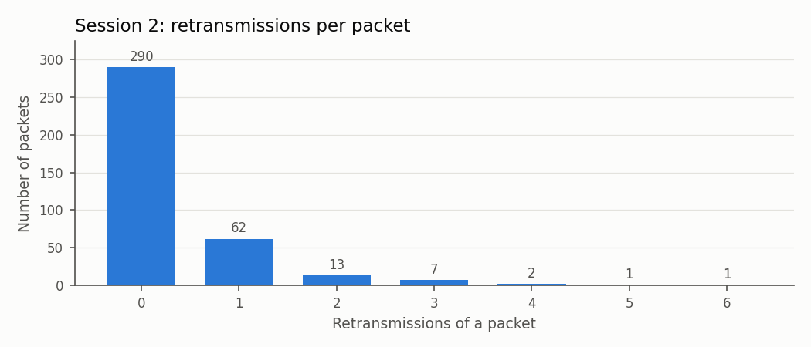

## Bit error rate

The program computes the BER itself. For each packet it estimates the probability of receiving the packet successfully as

$$P = \frac{ack}{ack + nack}$$

where $ack$ and $nack$ are the number of times the ACK and NACK codes were sent for that packet ($ack$ is 1). A packet of $L$ bits arrives without error with probability $P = (1 - BER)^L$, where $L = 58 \cdot 8 = 464$ here, so

$$BER = 1 - P^{1/L}.$$

The computed BER is 0 for packets with no retransmission, 0.00149273644122105 with one retransmission, 0.00236489810986629 with two, 0.00298324462035904 with three, 0.00346260749075078 with four, 0.00385410438149891 with five and 0.00418499029197428 with six. The `ber` column of the ARQ files in [`../results`](../results) holds these values.
